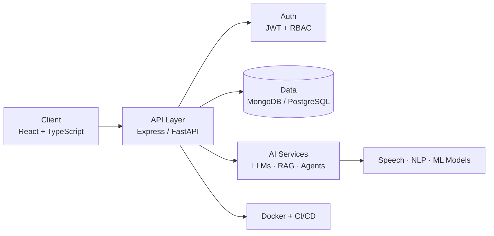
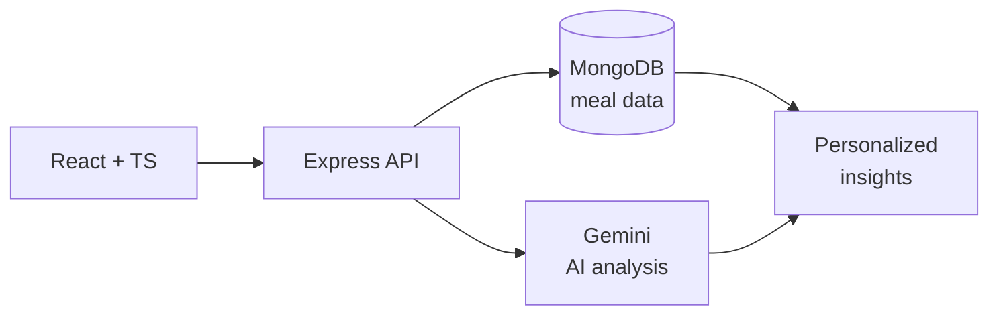
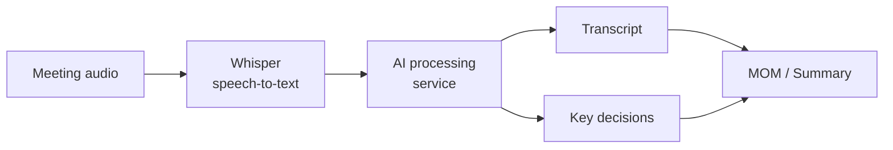
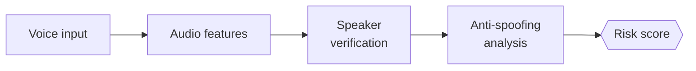
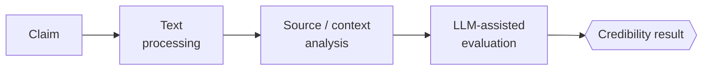
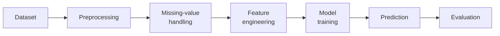
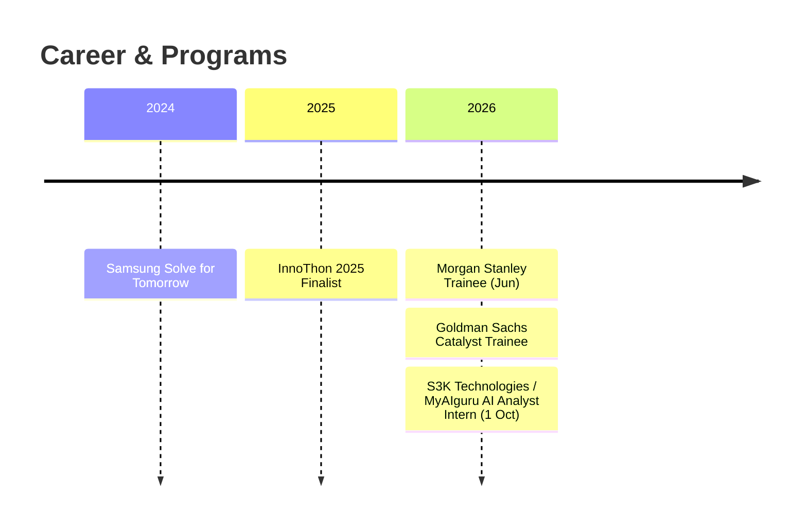

<div align="center">


<br><br>

<a href="https://linkedin.com/in/shweta-rawat-01a71733a"></a>
<a href="mailto:shwetarawat6106@gmail.com"></a>
<a href="https://leetcode.com/u/ShwetaRawat6106/"></a>

</div>

---

## 🖥️ `boot_sequence.log`

```bash
$ ./init_profile.sh --user shweta

[  OK  ] Loaded identity ............ AI/ML Engineer + Full-Stack Developer
[  OK  ] Mounted education .......... B.Tech AI & ML @ PES Modern College of Engineering · CGPA 9.6+
[  OK  ] Detected location .......... Pune, India
[  OK  ] Started service ............ Morgan Stanley (Trainee)            since Jun 2026
[  OK  ] Started service ............ Goldman Sachs Catalyst (Trainee)    ongoing
[  OK  ] Started service ............ S3K Technologies / MyAIguru (AI Analyst Intern)  since 1 Oct 2026
[  OK  ] Loaded modules ............. GenAI · Agentic AI · RAG · FastAPI · Microservices · System Design
[  OK  ] Mindset .................... Build → Break → Debug → Learn → Ship

>> System ready. Accepting collaboration requests.
```

---

## 👋 `whoami`

```python
class ShwetaRawat(Engineer):

    role      = "AI/ML Engineer + Full-Stack Developer"
    education = "B.Tech, AI & ML @ PES Modern College of Engineering"
    cgpa      = "9.6+"
    location  = "Pune, India"
    mindset   = "Build → Break → Debug → Learn → Ship"

    def specialties(self):
        return [
            "Generative AI & Agentic AI",
            "LLM applications: RAG, embeddings, agents",
            "Backend engineering & microservices",
            "System design",
            "DSA in C++",
        ]

    def run(self):
        while self.alive:
            self.learn(); self.build(); self.solve(); self.ship()
```

---

## 🔭 `live_status`

| Track | Status | Details |
|:--|:--:|:--|
| 🏦 **Morgan Stanley** | 🟢 Active | Trainee · since Jun 2026 |
| 💼 **Goldman Sachs Catalyst** | 🟢 Active | Trainee in the 2026 program |
| 🤖 **S3K Technologies / MyAIguru** | 🟢 Active | AI Analyst Intern · 6 months from 1 Oct 2026 |
| 🧠 **AI Engineering** | 🔨 Building | Agentic workflows · RAG pipelines · AI automation |
| ⚙️ **Backend** | 🔨 Building | FastAPI · auth · microservices · scalable architecture |
| 🧩 **DSA** | 🔁 Daily | C++ on LeetCode |
| ☁️ **Infra** | 📚 Learning | Docker · CI/CD · cloud deployment |

---

## 🧬 `system_architecture`

How I think about building AI products, end to end:



---

## ⚡ `tech_stack`

| Domain | Tools & Concepts |
|:--|:--|
| **AI / ML** | Supervised & unsupervised learning · feature engineering · model evaluation · predictive analytics |
| **AI Engineering** | NLP · Generative AI · LLM applications · RAG · embeddings · AI agents |
| **Backend** | REST APIs · JWT · RBAC · microservices · authentication · API integration |
| **Engineering** | Git · GitHub · Docker · CI/CD · testing · API design · system design |

<p>
<b>Languages</b><br>
<br><br>
<b>Frameworks</b><br>
<br><br>
<b>Databases</b><br>
<br><br>
<b>Tooling</b><br>

</p>

---

## 🏗️ `projects`

### 🥗 NutriSync AI
> AI-powered nutrition intelligence platform: log meals, get personalized, reasoned insights.



- 🍎 AI food analysis with transparent reasoning
- 📊 Macro and nutrition tracking against personalized goals
- 📚 Meal history · 🔐 JWT authentication

`React` `TypeScript` `Node.js` `Express` `MongoDB` `JWT` `Gemini`

---

### 🎙️ MeetSync AI
> Meeting intelligence as a microservices system: audio in, minutes of meeting out.



- 🎤 Speech-to-text and automated meeting-minutes generation
- 🧠 Decision extraction from transcripts
- ⚙️ FastAPI microservice · 🐳 Dockerized · 🔄 CI/CD workflows

`Python` `FastAPI` `TypeScript` `Node.js` `Docker` `Whisper` `REST`

---

### 🛡️ VeriVox
> Real-time voice anti-spoofing and speaker verification: detecting synthetic and cloned voices in live-call scenarios.



`Speech AI` `Speaker Verification` `Anti-Spoofing` `Risk Analysis`

---

### 🔎 FactCheckAI
> AI-assisted misinformation analysis: claim in, credibility assessment out.



`React` `TypeScript` `Flask` `SQLite` `SQLAlchemy` `LLM APIs`

---

### 🏥 MediMate ML
> End-to-end ML pipeline for preliminary disease classification.



`Python` `Scikit-Learn` `Pandas` `NumPy`

---

## 💼 `experience`



| Role | Org | Period | Focus |
|:--|:--|:--|:--|
| **AI Analyst Intern** | 🤖 S3K Technologies / MyAIguru | 6 months · from 1 Oct 2026 | `AI/ML` `Generative AI` `APIs` `Automation` `Software Engineering` |
| **Trainee** | 🏦 Morgan Stanley | Jun 2026 – Present | `Professional Communication` `Systems Design` |
| **Trainee** | 💼 Goldman Sachs Catalyst | 2026 · Ongoing | Structured industry training program |

Hands-on exposure to AI development, technical problem solving, and real-world software engineering workflows, alongside structured engineering and systems-design training at two of the world's leading financial institutions.

---

## 🏆 `achievements`

| Year | Achievement |
|:--:|:--|
| 2026 | 💼 **Goldman Sachs Catalyst 2026**: selected for the program (ongoing) |
| 2026 | 🎓 **Katalyst India Scholar** |
| 2026 | 🚀 **Code Bharat Hackathon**: advanced to Round 3 |
| 2025 | 🏆 **InnoThon 2025**: Finalist |
| 2024 | 💡 **Samsung Solve for Tomorrow** |

---

## 🧠 `competitive_programming`

<div align="center">
<a href="https://leetcode.com/u/ShwetaRawat6106/">

</a>
</div>

<details>
<summary><b>📂 DSA focus areas (click to expand)</b></summary>

```text
Data Structures  Arrays · Strings · Linked Lists · Stacks & Queues · Hashing · Trees · Graphs · Heaps · Recursion
Algorithms       Binary Search · Two Pointers · Sliding Window · Sorting · Greedy · Backtracking · DP · Graph Algorithms
```

</details>

---

## 📊 `github_telemetry`

<div align="center">


<br><br>

<br><br>

<br><br>

</div>

---

<div align="center">

### `while (alive) { learn(); build(); solve(); ship(); }`

**Thanks for visiting. Let's build something. 💜**


</div>
